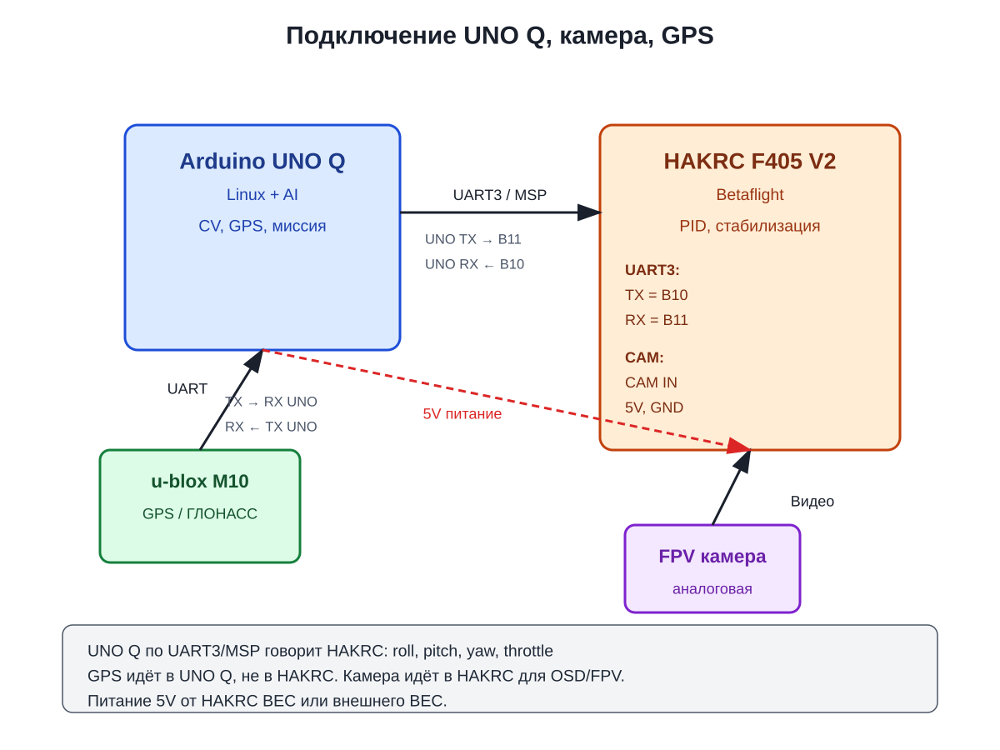
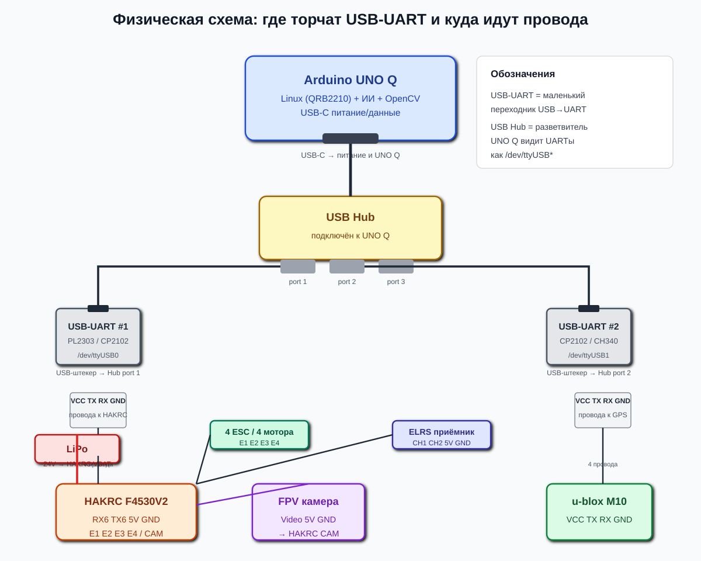

# План ветки HAKRC_F405V2

## Имеющееся железо

- **Полётный контроллер**: HAKRC F405 V2
- **Прошивка**: Betaflight
- **GPS**: u-blox M10 (TTL, 1–25 Гц, GPS/ГЛОНАСС/Galileo/BeiDou/QZSS/SBAS)
- **ESC**: 4 × ESC (готовы к подключению)
- **Камера**: аналоговая камера (FPV)
- **Видеопередатчик**: для FPV
- **Система управления**: ELRS
- **Бортовой компьютер**: Arduino UNO Q (Linux)

## Общая концепция

```text
[Arduino UNO Q, Linux + AI] —UART/MSP/SBUS→ [HAKRC F405 V2, Betaflight] —PWM/DShot→ [ESC → моторы]
                ↑
       [u-blox M10 GPS]

[Аналоговая камера] → [Видеопередатчик] → [FPV очки / приёмник]
```

- **HAKRC F405 V2 + Betaflight** — полётный контроллер. PID, IMU, барометр, OSD, стабилизация, управление моторами.
- **Arduino UNO Q** — бортовой компьютер. Linux, Python, OpenCV, ИИ. Принимает решения и отдаёт целевые команды.
- **UNO Q** не заменяет полётный контроллер, а **руководит** им.
- **Аналоговая камера** — только для FPV, не подключается к UNO Q.
- **GPS** — подключается к UNO Q, не к HAKRC.

## Роли

| Компонент | Задачи |
|-----------|--------|
| **UNO Q** | CV, GPS, планирование миссии, высокоуровневые команды |
| **HAKRC F405 V2** | Стабилизация, PID, PWM/DShot, IMU, барометр, failsafe |
| **ESC** | Управление моторами |
| **ELRS пульт** | Ручной контроль, резерв |

## Преимущества

1. **HAKRC F405 V2** уже умеет летать — PID, IMU, барометр, OSD — из коробки.
2. Не нужно писать полётный контроллер с нуля.
3. **UNO Q** занимается только умной частью: зрением, GPS, логикой.
4. Выбрана прошивка: **Betaflight**.

## Варианты связи UNO Q ↔ HAKRC F405 V2

| Протокол | Суть | Плюсы | Минусы |
|----------|------|-------|--------|
| **MSP** | Betaflight | Простой, удобен для управления | Нужно писать парсер |
| **SBUS/CRSF** | Имитация пульта | Просто, стандарт | Нет telemetry обратно, нужен инвертер |
| **UART + JSON/кастом** | Свой протокол | Гибко | Нужно писать с нуля |

## Распиновка и подключение

### Распиновка HAKRC F405 V2

| Функция | Пин |
|---------|-----|
| M1 | C08 |
| M2 | C09 |
| M3 | A08 |
| M4 | A09 |
| UART1 TX | B06 |
| UART1 RX | B07 |
| UART2 TX | A02 |
| UART2 RX | A03 |
| UART3 TX | B10 |
| UART3 RX | B11 |
| UART4 TX | A00 |
| UART4 RX | A01 |
| I2C SCL | B08 |
| I2C SDA | B09 |
| BEEPER | C13 |
| ADC_BATT | C01 |

### Подключение

| Компонент | HAKRC F405 V2 | Примечание |
|-----------|---------------|------------|
| **ESC 1** | M1 (C08) | — |
| **ESC 2** | M2 (C09) | — |
| **ESC 3** | M3 (A08) | — |
| **ESC 4** | M4 (A09) | — |
| **ELRS RX** | UART1 TX/RX | CRSF |
| **UNO Q** | UART3 TX/RX | MSP |
| **FPV камера** | CAM IN | — |
| **VTX** | VTX OUT / 5V-9V | — |
| **GPS** | — | подключается к UNO Q |

### Визуальная схема (USB-UART)

UNO Q работает под **Linux на QRB2210**. Прямые пины D0/D1 не используем. Связь с HAKRC и GPS — через USB-UART адаптеры.



### Матрица соединений плата/пин ↔ плата/пин (по физическим пинам)

> **Важно:** UNO Q будет работать под **Linux на QRB2210**. Прямые пины D0/D1 не используются, потому что ИИ и OpenCV работают на QRB2210. Связь с внешними устройствами — через **USB-UART адаптеры**, подключенные к USB Hub.
>
> **Прошивку HAKRC F405/F4530V2 не трогаем.** Оставляем заводскую Betaflight. Только включаем MSP на свободном UART — через Betaflight CLI или Configurator.

### Физическая схема размещения



На схеме видно, что USB-UART — это внешние флэшки, воткнутые в USB Hub. От них 4 провода идут к HAKRC и GPS.

#### UNO Q ↔ HAKRC F4530V2 (MSP через USB-UART #1)

| HAKRC F4530V2 / пин | ↔ | USB-UART #1 / пин | Сигнал |
|---------------------|---|-------------------|--------|
| RX6 | ↔ | TX | MSP от UNO Q (TX→RX) |
| TX6 | ↔ | RX | Ответ к UNO Q (RX←TX) |
| 5V | ↔ | VCC | Питание USB-UART #1 |
| GND | ↔ | GND | Земля |
| USB-UART #1 / USB | ↔ | UNO Q / USB-A (через USB Hub) | /dev/ttyUSB0 |

#### GPS → UNO Q (через USB-UART #2)

| USB-UART #2 / пин | ↔ | u-blox M10 / пин | Сигнал |
|-------------------|---|------------------|--------|
| TX | ↔ | RX | Конфигурация GPS |
| RX | ↔ | TX | NMEA данные |
| VCC | ↔ | VCC | 5V питание |
| GND | ↔ | GND | Земля |
| USB-UART #2 / USB | ↔ | UNO Q / USB-A (через USB Hub) | /dev/ttyUSB1 |

#### FPV камера → HAKRC F4530V2

| HAKRC F4530V2 / пин | ↔ | FPV камера / пин | Сигнал |
|---------------------|---|------------------|--------|
| CAM | ↔ | Video | Аналоговое видео |
| 5V | ↔ | 5V | Питание |
| GND | ↔ | GND | Земля |

#### ESC → HAKRC F4530V2

| HAKRC F4530V2 / пин | ↔ | ESC / пин | Сигнал |
|---------------------|---|-----------|--------|
| E1 | ↔ | ESC 1 / Signal | PWM мотор M1 |
| E2 | ↔ | ESC 2 / Signal | PWM мотор M2 |
| E3 | ↔ | ESC 3 / Signal | PWM мотор M3 |
| E4 | ↔ | ESC 4 / Signal | PWM мотор M4 |
| 5V | ↔ | ESC / VCC (если нужно) | Питание ESC |
| GND | ↔ | ESC / GND | Земля ESC |

#### ELRS → HAKRC F4530V2

| HAKRC F4530V2 / пин | ↔ | ELRS / пин | Сигнал |
|---------------------|---|------------|--------|
| CH1 | ↔ | TX | CRSF TX |
| CH2 | ↔ | RX | CRSF RX |
| 5V | ↔ | 5V | Питание |
| GND | ↔ | GND | Земля |

> На схеме HAKRC пины CH1/CH2 рядом с TBS. Для ELRS порядок тот же: CH1/CH2 = TX/RX CRSF.
> Если на твоём ELRS приёмнике другая маркировка, подключи TX ELRS → RX CH1, RX ELRS → TX CH2.

#### Питание

| Источник / пин | ↔ | HAKRC F4530V2 / пин | Сигнал |
|----------------|---|---------------------|--------|
| LiPo / VBAT+ | ↔ | VBAT | Плюс 24V |
| LiPo / GND | ↔ | GND | Минус |

#### USB-Hub → UNO Q

| Устройство 1 / пин | ↔ | Устройство 2 / пин | Сигнал |
|--------------------|---|--------------------|--------|
| UNO Q / USB-C | ↔ | USB Hub / upstream | Питание + данные |
| USB Hub / port 1 | ↔ | USB-UART #1 / USB | HAKRC MSP |
| USB Hub / port 2 | ↔ | USB-UART #2 / USB | GPS NMEA |

### Блок-схема устройств с пинами

```text
[LiPo VBAT+/GND] ↔ [HAKRC F4530V2 VBAT/GND]

[HAKRC F4530V2]
  ├── E1  ↔ [ESC 1 Signal]
  ├── E2  ↔ [ESC 2 Signal]
  ├── E3  ↔ [ESC 3 Signal]
  ├── E4  ↔ [ESC 4 Signal]
  ├── RX6  ↔ [USB-UART #1 TX]
  ├── TX6  ↔ [USB-UART #1 RX]
  ├── 5V   ↔ [USB-UART #1 VCC]
  ├── GND  ↔ [USB-UART #1 GND]
  ├── 5V   ↔ [USB-UART #2 VCC]
  ├── GND  ↔ [USB-UART #2 GND]
  ├── CAM  ↔ [FPV камера Video]
  ├── 5V   ↔ [FPV камера 5V]
  ├── GND  ↔ [FPV камера GND]
  ├── CH1  ↔ [ELRS TX]
  └── CH2  ↔ [ELRS RX]

[USB-UART #1] ↔ USB ↔ [USB Hub] ↔ USB ↔ [UNO Q, Linux QRB2210]
[USB-UART #2] ↔ USB ↔ [USB Hub]
[USB-UART #2 TX] ↔ [u-blox M10 RX]
[USB-UART #2 RX] ↔ [u-blox M10 TX]
[USB-UART #2 VCC] ↔ [u-blox M10 VCC]
[USB-UART #2 GND] ↔ [u-blox M10 GND]
```

### Питание

```text
LiPo → HAKRC F405 V2 → BEC 5V → UNO Q, GPS
```

## Что нужно уточнить

1. Какой протокол связи UNO Q ↔ HAKRC F405 V2? (MSP / SBUS / кастом)
2. Какие UART-пины свободны на HAKRC F405 V2?
3. Какие пины можно задействовать под UNO Q?
4. Как питается UNO Q на дроне?
5. Какая версия Betaflight стоит на HAKRC F405 V2?

## Предварительный план

### Этап 1 — Подключение и настройка HAKRC F405 V2

1. Убедиться, что HAKRC F405 V2 прошит Betaflight.
2. Подключить ESC, моторы, приёмник ELRS.
3. Подключить аналоговую камеру и видеопередатчик.
4. Провести базовую калибровку.
5. Убедиться, что дрон летает в ручном режиме.

### Этап 2 — Подключение UNO Q

1. Подключить UNO Q к HAKRC F405 V2 по UART.
2. Настроить питание 5V.
3. Подключить u-blox M10 GPS.

### Этап 3 — Протокол связи

1. Выбрать MSP / SBUS / кастом.
2. Настроить HAKRC F405 V2 на приём команд по UART.
3. Написать Python-мост на UNO Q.

### Этап 4 — Первые команды

1. UNO Q отправляет: "взлететь", "зависнуть", "лететь в точку".
2. HAKRC F405 V2 выполняет.
3. Пульт имеет приоритет.

### Этап 5 — Автономность

1. CV: обнаружение объектов.
2. GPS: маршрутные точки.
3. Распознавание целей и действия.

## Пока что

- Не пишем код.
- Не подключаем железо.
- Только обсуждаем и планируем.

---

*Создано: 31 июля 2026*
*Ветка: HAKRC_F405_V2*
