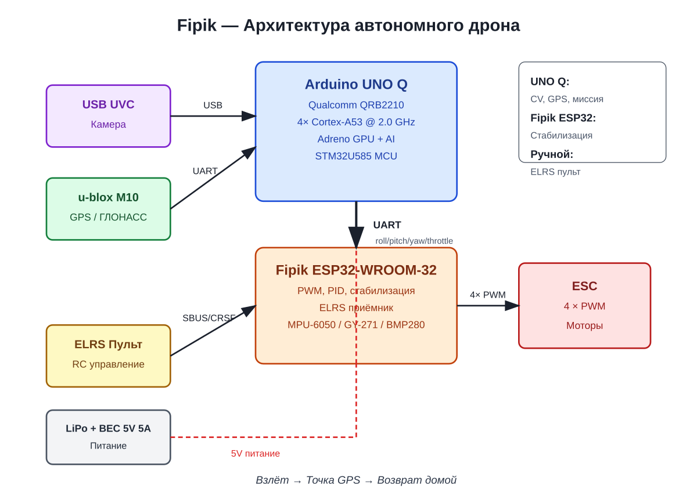

# ROADMAP — Fipik автономный дрон

## 📦 Что уже есть

- ✅ Дрон (рама, моторы, ESC, пропеллеры)
- ✅ Полётный контроллер **ESP32-WROOM-32** (Fipik)
- ✅ **Arduino UNO Q** (Qualcomm QRB2210 + STM32U585)
- ✅ **USB UVC камера**
- ✅ **u-blox M10 GPS** (QU10T)
- ✅ **GY-271** (компас)
- ✅ **MPU-6050** (IMU)
- ✅ ELRS-система управления
- ✅ Прошивка Fipik с PWM, OLED и WiFi конфигуратором
- ✅ Индивидуальная калибровка моторов (`min_us`, `max_us`, rotation)
- ✅ Android-приложение для настройки
- ✅ Пульт RC с ARM, газ, yaw, pitch, roll

## 🚀 Цель

Полностью автономный дрон с:
- компьютерным зрением;
- GPS-навигацией;
- планированием маршрута;
- без связи с землёй.

## 📖 Глоссарий

| Термин | Значение |
|--------|----------|
| **унокю** | Arduino Uno Q (бортовой компьютер) |
| **фипик** | ESP WROOM 32 (полётный контроллер) |
| **пины** | подписанные на плате контакты |
| **гпс** | u-blox M10 ublox10 TTL QU10T M10 GPS |
| **Т19** | ноутбук Lenovo T16 / Ubuntu 24.04 |
| **впс** | VPS `oleg@46.8.221.179:4101` |
| **гит** | рабочий репозиторий на GitHub |

## 🏗️ Архитектура



```text
[USB UVC Камера] → [Arduino UNO Q] —UART→ [Fipik ESP32-WROOM-32] —4×PWM→ [ESC → Моторы]
                          ↑
                [u-blox M10 GPS]
                          ↑
                [ELRS Пульт] → [Fipik ESP32]
                          ↑
                [LiPo + BEC 5V 5A] → всё
```

### Роли

| Блок | Задачи |
|------|--------|
| **Arduino UNO Q** | CV, GPS, планирование миссии, расчёт yaw/distance |
| **Fipik ESP32-WROOM-32** | ELRS, IMU, компас, PID, стабилизация, PWM |
| **ESC/моторы** | Исполнение команд |
| **ELRS пульт** | Ручной контроль и failsafe |
| **BEC 5V 5A** | Питание UNO Q, Fipik, сенсоров |

---

## 🛋️ Этап 1 — "Диванные" эксперименты (сейчас)

### Что подключить

```text
[USB UVC Камера] → [Arduino UNO Q, USB]
[u-blox M10 GPS] → [Arduino UNO Q, UART]
[Arduino UNO Q]  → [ПК, USB-C / WiFi]
```

### Что проверить

1. **UNO Q загружается** в Linux/Android.
2. **USB камера определяется** (`/dev/video0`).
3. **GPS определяется** (`/dev/ttyUSB0` или `/dev/ttyACM0`).
4. **OpenCV читает кадр** с USB камеры.
5. **Python читает NMEA** с GPS.
6. **Математика GPS** считает: расстояние, bearing, yaw_error.
7. **Команды по UART** — UNO Q → Fipik (без моторов, только лог).

### Результат

- UNO Q видит видео.
- UNO Q получает координаты.
- UNO Q печатает команды для Fipik.
- Моторы не включаются.

---

## 🧪 Этап 2 — Безопасные наземные испытания

### Меры безопасности

- **Сняты пропеллеры** — обязательно.
- **Аккумулятор отключён** при настройках.
- USB-питание от компьютера.
- Пульт в руках оператора, ARM в OFF.

### Что проверить

1. **Работа RC + ELRS**
   - ARM переключатель;
   - минимум/максимум газа;
   - корректность каналов.

2. **Калибровка моторов**
   - `min_us` и `max_us`;
   - направление вращения;
   - равномерный старт.

3. **ARM без пропеллеров**
   - моторы крутятся на холостом;
   - газ набирает обороты.

4. **Связь UNO Q ↔ Fipik по UART**
   - команды доходят;
   - Fipik понимает формат;
   - OLED показывает статус.

---

## 🌾 Этап 3 — Полевые испытания с винтами

### Подготовка

- площадка без людей и животных;
- трос/привязка для первых попыток;
- ветер до 5 м/с;
- запасной аккумулятор.

### Что проверить

1. **Взлёт и зависание** в ручном режиме.
2. **Failsafe**: потеря RC → hover/land.
3. **Автономные команды от UNO Q**: yaw, forward, hover.
4. **Первый GPS-тест**: взлёт, hover 10 сек, land.

---

## 🛰️ Этап 4 — GPS-навигация

### Железо

| Компонент | Статус |
|-----------|--------|
| u-blox M10 GPS | ✅ |
| GY-271 | ✅ |
| MPU-6050 | ✅ |
| BMP280 | ⚠️ желательно купить |

### Что на UNO Q

- `gpsd` или Python + pyserial;
- чтение `$GNGGA` / `$GNRMC`;
- Haversine + bearing;
- PID по yaw / позиции;
- хранение HOME и WAYPOINT;
- команды Fipik по UART.

### Что получится

- "лети к точке A";
- возврат домой (RTH);
- маршрут из 2–3 точек.

---

## 🧠 Этап 5 — Компьютерное зрение

### На Arduino UNO Q

- OpenCV + USB UVC камера;
- HSV слежение за цветным объектом;
- ArUco / QR маркеры;
- Optical flow;
- TensorFlow Lite / Qualcomm AI SDK (если поддерживается).

### Связь с Fipik

```text
[UNO Q видит объект] → [расчёт yaw/pitch] → [UART] → [Fipik]
```

---

## 🏠 Этап 6 — Полная автономия

### Миссия

```text
Взлёт → Точка GPS → Распознавание объекта → Действие → Возврат домой → Посадка
```

### Что умеет

- взлёт из точки A;
- лететь к GPS-точке;
- распознавать цель по CV;
- выполнять действие (зависнуть, сфотографировать, следовать);
- возврат домой;
- плавная посадка.

---

## 💰 Чего докупить

| Компонент | Зачем | Цена |
|-----------|-------|------|
| **BMP280** | высота | $1–2 |
| **Провода Dupont** | подключение | $1–2 |
| **BEC 5V 5A** | питание UNO Q + всё | $3–5 |
| **USB-A → USB-C OTG** | камера к UNO Q | $1–2 |
| **Феррит на USB кабель** | от помех | $1 |
| **TF карта 32GB** | UNO Q / камера | $3–5 |
| **Трос / привязь** | безопасные тесты | $3–5 |

**Итого: ~$15–25.**

---

## ⚠️ Правила безопасности

1. **Пропеллеры сняты** — при любых настройках.
2. **Аккумулятор отключён** при подключении/отключении.
3. **USB-питание только** при тестах на диване.
4. **Пульт в руках**, ARM в OFF по умолчанию.
5. **Первый полёт — привязанный** дрон.
6. **Площадка без людей** для свободных полётов.
7. **Failsafe** на потерю GPS, RC, связи UNO Q ↔ Fipik.

---

## 📝 Следующие шаги (приоритет)

1. **Проверить ОС на Arduino UNO Q** — Linux или Android.
2. **Подключить USB UVC камеру** — `ls /dev/video*`.
3. **Подключить GPS** — `ls /dev/tty*`, проверить NMEA.
4. **Настроить UART** UNO Q ↔ Fipik.
5. **Протокол команд**: JSON или бинарный.
6. **Диванный тест**: видео + GPS + отправка команд в Fipik.
7. **Безопасный наземный ARM** без пропеллеров.
8. **Полевой GPS-тест** с привязкой.

---

*Обновлено: 30 июля 2026*
